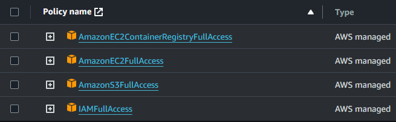

# AWS

> [!NOTE]
> Assumes aws-cli and terraform are set up on the host system.

1. Open your CLI
1. `cd oaken-spirits/src/production/aws` <- continue to work from this directory.
1. Edit `provider.tf`**profile** with the profile in your `.aws/config` file.3
    - Ensure the profile has the following access
    
1. Terraform (each run will create a new public/private key pair).
    - `terraform init`
    - `terraform plan`
    - `terraform apply`
1. Parameter Store
    - For instructions on how to create parameters watch [this video](https://www.youtube.com/watch?v=8Hstqmge71w) starting at 14:14.
    - Create these parameters:
        - All set to type string, Data type text.
        - KAFKA_SERVER= Enter the private IP of the kafka server
        - MYSQL_HOST= Enter the private IP of the database server
        - MYSQL_ROOT_PASSWORD = mysql
        - MYSQL_USER = mysql
        - MYSQL_PASSWORD = mysql
        - MYSQL_DATABASE = oaken
1. Export private key
    - `terraform output private_key_pem > oaken-pair.pem` <- note where this key is stored (oaken-spirits/src/production/aws).
    - `chmod 600 ~/.ssh/oaken-pair.pem`

1. SSH into each EC2 instance.
    - In a new command window, `cd oaken-spirits/src/production/aws`
    - select EC2 instance.
    - Connect (upper right).
    - SSH, copy and run command.

1. Database setup
    - `sudo vi /etc/mysql/mysql.conf.d/mysqld.cnf`
    - update bind address to 0.0.0.0
    - `sudo systemctl restart mysql`

1. Set up Cloud Beaver locally on docker
    - `docker-compose -f cbeaver.yml up -d`
    - MySQL server public IP can be retrieved from AWS from the virtual machine details.
    - See **CLOUD_BEAVER.md**

1. Kafka set up: see **[1A_KAFKA_AWS.md](1A_KAFKA_AWS.md)**

1. Implement for each of the non-database/kafka instances (SSH in)
    - SSH into server
    - `touch env_variables.sh`
    - `vi env_variables.sh`
    - copy the **env_variables.sh.template** to **env_variables.sh**
        - Update host address with your servers private IP

> [!NOTE]
> These are from my repository, you could also get them from the forked repository.

- `mkdir app`
- `cd app`
- Application application, `wget` based on the VM instance you are logged into.
  - *mysql-api.py*: `wget https://raw.githubusercontent.com/gregorywmorris/oaken-spirits/main/src/production/aws/app/mysql-api/mysql-api.py`
  - *shipping.py*: `wget https://raw.githubusercontent.com/gregorywmorris/oaken-spirits/main/src/production/aws/app/shipping/shipping.py`
  - *accounting.py*: `wget https://raw.githubusercontent.com/gregorywmorris/oaken-spirits/main/src/production/aws/app/accounting/accounting.py`
  - Service file, `wget` based on the VM instance you are logged into.
- *oaken-mysql-api.service*: `wget https://raw.githubusercontent.com/gregorywmorris/oaken-spirits/main/src/production/aws/app/mysql-api/oaken-mysql-api.service`
    1. `sudo cp oaken-mysql-api.service /etc/systemd/system/`
    1. `sudo systemctl enable oaken-mysql-api.service`
    1. `sudo systemctl start oaken-mysql-api.service`
    1. `sudo systemctl status oaken-mysql-api.service`
- *oaken-shipping.service*: `wget https://raw.githubusercontent.com/gregorywmorris/oaken-spirits/main/src/production/aws/app/shipping/oaken-shippping.service`
- *oaken-accounting.service*: `wget https://raw.githubusercontent.com/gregorywmorris/oaken-spirits/main/src/production/aws/app/accounting/oaken-accounting.service`
