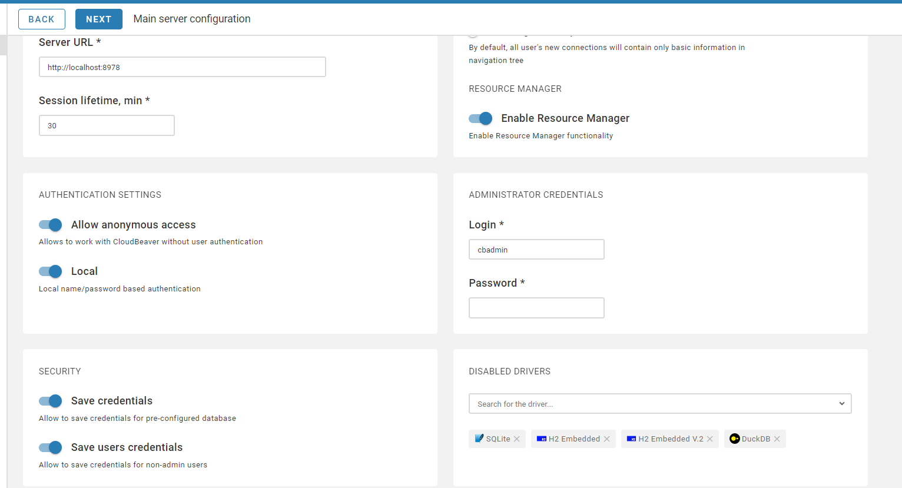
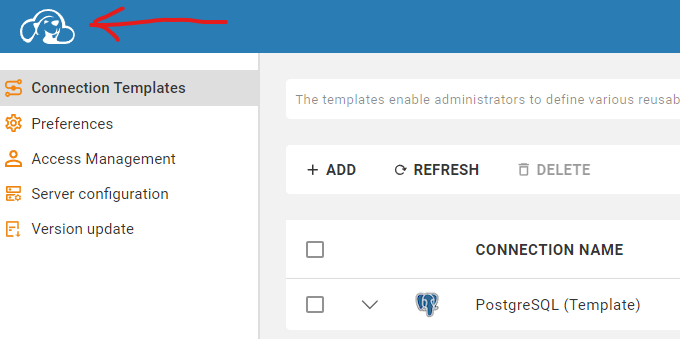
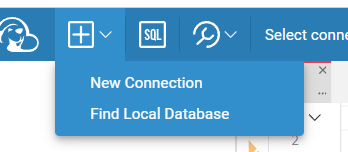
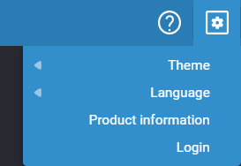

# Cloud Beaver

## FYI 
Cloud Beaver community edition is the free version of [DBeaver](https://dbeaver.com/download/cloudbeaver/). DBeaver allows connection to multiple databases though one interface.

The GitHub repository is [here](https://github.com/dbeaver/cloudbeaver) and you can find the docker image [cloud-beaver/here](https://hub.docker.com/r/dbeaver/cloudbeaver).

## Instructions

1. Verify oaken-dbeaver docker container is running
1. In your browser go to `localhost:8978`
1. Select the **Next** button
1. Internal Server Configuration page
    - In **ADMINISTRATOR CREDENTIALS** enter desired login credentials

1. Select **Next** and then **Finish**
1. Login

1. Select the cbeaver icon in the upper left

1. Select the **"+"** icon, **New Connection** and choose postgres from the list

1. Enter the information shown here

    - Enter either **Host** name (**oaken-postgres** for docker) or public IP address for cloud solutions
    - Enter **Port** 5432
    - Enter Username = postgres
    - Enter Password = postgres
    - Enter Database = oaken
    - Select **Test** and in the bottom right you should get pop up with a green check and **Connection is Established**

    - Select **Create**
1. Connect
    - Select the connection from the top drop down.
    - Select the **oaken** database
    - **Note:** You must select the connection and the database else the SQL editor will not associate with the connection. The tool is designed for multiple connections, so one must be selected.
1. Confirm database
    - Using the down arrows on the left open the connection, Databases, oaken, Tables and you should see a list of tables.

        
    - Verify a table
        - Select the **SQL** icon from above
        - Insert `select * from sales;`
        - From the left click the **orange arrow**
        - Alternatively you can select the **orange list** icon to run a script if it had multiple statements.
1. postgres is ready for data ingestion
1. To log back in after a timeout or logout, select the gear on the upper right.

