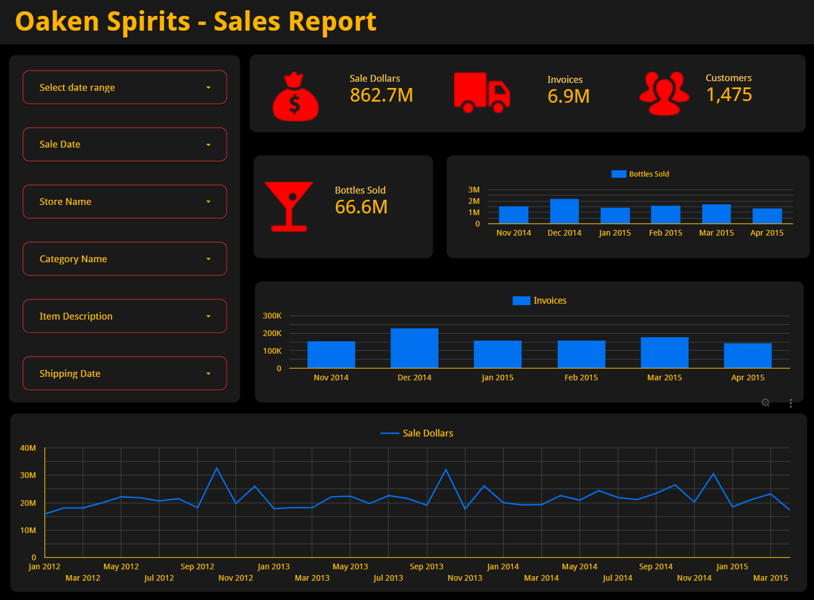

# Dashboard

[Interactive Sales Dashboard](https://lookerstudio.google.com/reporting/b11975fd-2fc5-4d0b-92fb-e65ff59aa910)

>[!TIP]
>OPTIONAL: If you wish to have a large amount of data be sure to run the `streaming-invoice-docker` for sufficient time, I let it run for 10+ hours. You see in the README.mn video I have over 2 million rows. I materialized Dagster throughout that time to reduce the processing it had to do for the final run.

## Looker Dashboard

### Set up data source

Dashboard status: down 6/4/2024

1. Open web browser and go to [Looker Studio](https://lookerstudio.google.com/).
1. Login with the same account as GCP
1. Select **Blank Report**
    - In **Add data to report** popup select **BigQuery**
    - Select **Authorize** if asked. You should be taken directly to projects.
    - Select your GCP project
    - Select **oaken_transformed**
    - Select **full_sales**
    - In the bottom right select **Add**
    - You may get a popup, select **Add To Report**

### Build dashboard

1. Use above image as a general guide
1. Primary font color dark-yellow
1. Header background color redish-orange
1. Title: **Oaken Spirits - Sales Report**
1. Left window filters
    - Date Range control
    - Drop downs
        - Sale Date
        - Store Name
        - Category Name
        - Item Description
        - Shipping Date
1. Charts: Scorecards
    - Use images in `images/dashboard`
        - [Red icon source](https://www.iconsdb.com/red-icons/)
    - Invoices: Scorecard with compact numbers
    - Customers: Scorecard
    - Bottles Sold: Scorecard with compact numbers
    - Sales Dollars: Scorecard with compact numbers
1. Charts: Bar and Line
    - All align legend center
    - All have Date range Dimension SaleDate
    - All have dimension of SaleDate(YearMonth)
    - All sort SaleDate(Date) Descending.
    - In Style, Bars 12. This provides the latest date and goes back at least 12 months.
    - Reverse x-axis for bar charts
    - Top bar: Invoice
    - Middle bar: BottlesSold
    - Bottom is Time series, Sales Dollars
