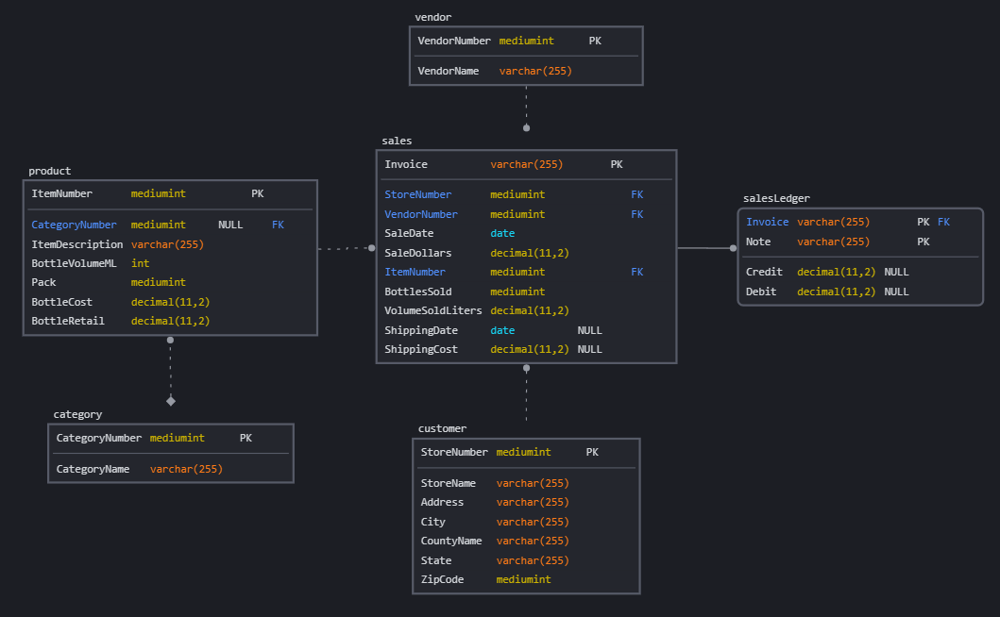

# Oaken Spirits Technical Design Document

## 1. Description of the Problem

Oaken Spirits is looking to expand and the current application implementations are not scalable, do not deliver real-time updates, have multiple databases, and lack a consolidated analytics solutions.

## 2. Solution Requirements

1. Create a scalable solution.
1. Create a data pipeline that integrates the systems and provides real-time updates.
1. Create a single database as the single source of truth (SSOT).
1. Provide an analytics solution for management.

## 3. Glossary

- **A single source of truth (SSOT):** The practice of aggregating the data from many systems within an organization to a single location. Rule enforcement used to ensure this data is trustworthy.
- **Scope creep:** Adding additional features or functions of a new product, requirements, or work that is not authorized during project scoping.
- **OLTP:** Online Transactional Processing. I.e. every day business services.
- **OLAP:** Online analytical processing. For data analytics, often columnar rather than row based.
- **Pub/sub message queue:** Publisher and subscriber message queue. Where a source publishes messages to a queue and a subscribers get those messages from the queue.
- **ELT:** Extract, Load, Transform. The order of operations in a data transfer.
- ***bibyte:** A suffix used in the context of a binary systems, where multiples of 2 are used instead of multiples of 10. Example: kibi instead of kilo.
- **Multiples of *bibytes**
  - 1 kibibyte (KiB) = 1,024 bytes
  - 1 mebibyte (MiB) = 1,024 KiB
  - 1 gibibyte (GiB) = 1,024 MiB
  - 1 tebbibyte (TiB) = 1,024 GiB
  - 1 pebibyte (PiB) = 1,024 TiB
  - 1 exbibibyte (EiB) = 1,024 PiB
  - 1 zebbibibyte (ZiB) = 1,024 EiB
  - 1 yobbibibyte (YiB) = 1,024 ZiB

## 4. Out of Scope (Non-goals)

1. Implementing new applications that are not required for the initially identified requirements.

## 5. Assumptions

1. Data contracts will be enforced.
1. Kafka will allow better integration of future applications.

## 6. Solution

### Overview

1. Scalable: Docker provides an scalable service (within the confines of our data center). Internally accessed applications, from a small staff allow our local data center service these applications.
1. Service Integration:
    - Kafka Pub/sub Message queue to transfer data between services.
        - Apache Kafka can scale to over a 1 million messages a second.
    - Custom API for invoice integration with MySQL.
1. Single Source of Truth: Integrate into MySQL database for all data.
1. Analytics:
    - Data warehouse: Google BigQuery
    - Airbyte: Database snapshot used for extract and load to BigQuery

### Database

#### Data Retention

1. **OLTP database:** 2 years. Data beyond this point moved to a data warehouse.
1. **Data Warehouse:** 10 years for audit requirements.

#### Entity Relationship Diagram

#### Data Types

MySQL data types

| Type | Storage(Bytes) | Minimum Value Signed | Minimum Value Unsigned | Maximum Value Signed | Maximum Value Unsigned |
|:---| :---: | :---: | :---: | :---: | :---: |
| MEDIUMINT | 3 | -8388608 | 0 | 8388607 | 16777215 |
| INT | 4 | -2147483648 | 0 | 2147483647 | 4294967295 |
| DECIMAL(11,2) | 8 | -999999999.99 | 0 | 999999999.99 | 999999999.99 |
| VARCHAR(255) | 0 to 255 | 0 | 0 | 65,535 | 65,535 |
| Date | 3 | \- | \- | \-| \- |

## 7. Security Considerations

1. Exposed ports:
    - All VMs SSH port 22.
    - Kafka port 9092,9093,9094, 19092,19903,19904
    - MySQL 33060.
1. Sensitive data
    - GCP service account `.json` file
    - MySQL credentials
    - Cloud Beaver credentials
    - Customer personally identifiable data
    - Business operational data

## 8. Cost Analysis

Oaken Spirits preference is budget conscious choices that will grow as the company grows rather than a system that can necessarily support future growth out of the box.

Open source applications with in-house support are preferred over paid.

### Application Cost Estimate

1. Continue to use legacy applications, no additional costs.
1. Open source database and integration solutions, no additional costs.
    - Monitor hardware usage for future need for expansion.
1. Google Bigquery, see below.

### Cloud Cost Estimate

- BigQuery pricing [documentation](https://cloud.google.com/bigquery?hl=en#pricing).
- Currently Oaken Spirits would remain in the [free tier](https://cloud.google.com/bigquery/pricing#free-tier).
- See data calculations [here](documentation/DATA_CALCULATIONS.md)
- With daily updates to BigQuey, we would start to incur costs at 10 GiB
- Row total ingestion is about 693 bytes
- **Storage** will incur costs once we pass approximately 15,467,086 rows (total across all BigQuery tables).
    - **Note:** any data marts/views would be included in this total.
- **Queries** will incur costs once we pass approximately 1,587,857,143 rows.
- With current sales it would take decades to pass storage cost concerns. However monitoring is required as we move into the national market.

## 9. Operational Readiness Considerations

1. Deployment on docker server.
1. Additional monitoring required for new implementations.
    - Consider automating monitoring.
    - Integration disruption.
    - Network monitoring for increased traffic.
1. Additional training of IT staff for on call support.
1. Increased access management requirements and monitoring.
1. Increase backups for new MySQL database.
1. Application downtime process required to address integrations not flowing.
    - Will operations resort to manual entry or wait for system to resume?
    - How will backlogged data be caught up?

## 10. Cross-region Considerations

Not applicable.

## 11. Risks and Open Issues

1. Security requirements need to be updated to specifically address cloud solutions.
    - Auditing
    - Access
    - Application connections
    - Data management

## 12. Solutions considered and discarded

### Solutions cost of ownership that exceeded our current needs

- Data processing: Apache Spark
- Data streaming:
  - Redpanda
  - RabbitMQ
- Orchestration:
  - Apache Airflow
  - Mage
- Database: Postgres
- Data warehouse:
  - AWS Redshift
  - Databricks
  - Snowflake
  - Fivetran

### Solutions for future consideration

- Customer Relation Management (CRM) for sales
  - Salesforce
  - Zoho
  - Hubspot
- Shipping
  - Shippo
  - ShipStation
  - AfterShip
- Accounting software
  - Intuit (multiple solutions)
  - Zoho Books
  - Sage

## 13. Work Required

**Implementation:**

1. Kafka - M
1. Custom MySQL API - M
1. MySQL database - S
1. Data pipeline - L
    - Multiple linked applications
1. Bigquery - S
1. Dashboard - M

**Support:**

1. Overall ongoing support - L

## 14. High-level Test Plan

Testing will be to non-production docker environment and to temporary data warehouse tables. Data warehouse temp tables are destroyed after use.

## 15. References

- [BigQuery pricing](https://cloud.google.com/bigquery?hl=en#pricing)
  - [Free tier](https://cloud.google.com/bigquery/pricing#free-tier)
- [Data calculations](DATA_CALCULATIONS.md)
- [ERD creation tool](https://sqldbm.com/)