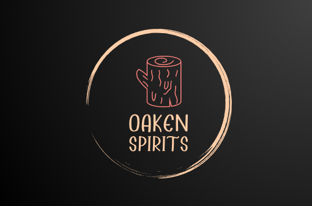
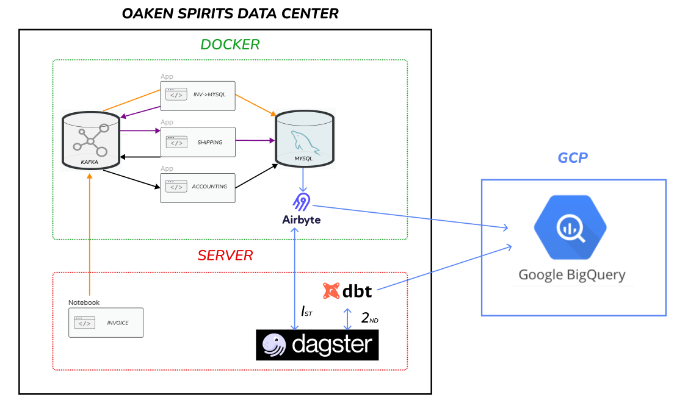

## Project Prompt

### Overview

Oaken Spirits is an alcohol distributor that gets its name from its popular private selection of whiskey. Its popularity has spurred growth and the company has recently signed a deal to expand at a national level with several large vendors. Currently, the applications supporting the business are for Iowa sales only and the CEO is concerned that they will not support future growth and would like a system that can handle national-level sales.

### Scenario

Oaken Spirit applications store data locally and do not integrate with external databases. Working with the vendors we can get a JSON message from each application.

### Concern

1. Not scalable - some manual data entry and transfers
1. Does not deliver real-time updates
1. Has data in multiple locations; sometimes duplicated.
1. Lacks a consolidated analytics solutions
1. Lacks integration options making replacement or adding applications difficult

### Objectives

1. Create a single database as the source of truth
1. Create a data pipeline that integrates the systems and provides real-time updates
1. Ensure the system is scalable
1. Provide an analytics solution for management

### Technical Design

See [OAKEN_TECHNICAL_DESIGN](OAKEN_TECHNICAL_DESIGN.md)

## Data

[Dataset](https://www.kaggle.com/datasets/residentmario/iowa-liquor-sales)

1. [Ubuntu Kaggle API instructions](https://www.endtoend.ai/tutorial/how-to-download-kaggle-datasets-on-ubuntu/)
1. `kaggle datasets download -d residentmario/iowa-liquor-sales`
1. Alternatively, download data via the web browser
1. `unzip iowa-liquor-sales.zip 'unzip iowa-liquor-sales_dirty.csv'` - 3.47 GB file

## Set Up Services

### Instructions order

1. AWS S3
1. Environment Variables
1. Choose either AWS or local Docker for Business Services
1. Analytics

### AWS S3

1. See [**AWS_S3.md**](AWS_S3.md)

### Environment Variables

1. See [**ENV_VARIABLES.md**](ENV_VARIABLES.md)

### Business Services

- On AWS

1. Create EC2: see [**EC2.md**](EC2.md)
1. Kafka: see [**1A_Kafka_AWS.md**](1A_Kafka_AWS.md)
1. Run business services: see [**2A_AWS.md**](2A_AWS.md)

or

- On local Docker

1. Kafka: see [**1B_KAFKA_ON_DOCKER.md**](1B_KAFKA_ON_DOCKER.md)
1. Run business: see [**2B_LOCAL_DOCKER.md**](2B_LOCAL_DOCKER.md)

### Analytics

1. Run analytics services: see [**3_ANALYTICS.md**](3_ANALYTICS.md)