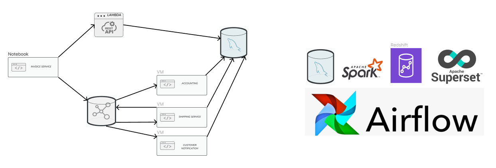

# Oaken Spirits
Liquor sales data engineering project.

[Dataset](https://www.kaggle.com/datasets/residentmario/iowa-liquor-sales)

1. [Ubuntu Kaggle API instructions](https://www.endtoend.ai/tutorial/how-to-download-kaggle-datasets-on-ubuntu/)
1. `kaggle datasets download -d residentmario/iowa-liquor-sales`
1. Alternatively, download data via web browser
1. `unzip iowa-liquor-sales.zip` - 3.47 GB file

## Services Set Up

1. Kafka: See **Set_Up_Kafka.md**
1. Run Services on docker
    